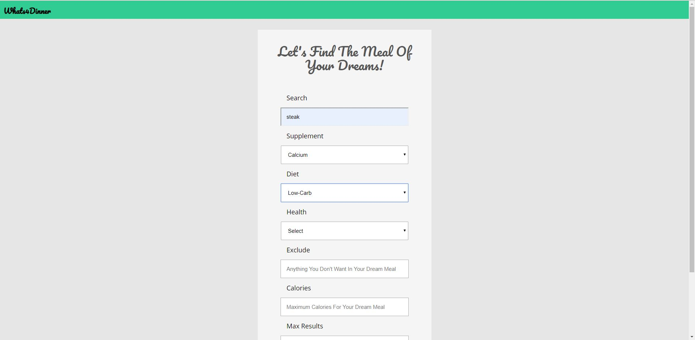
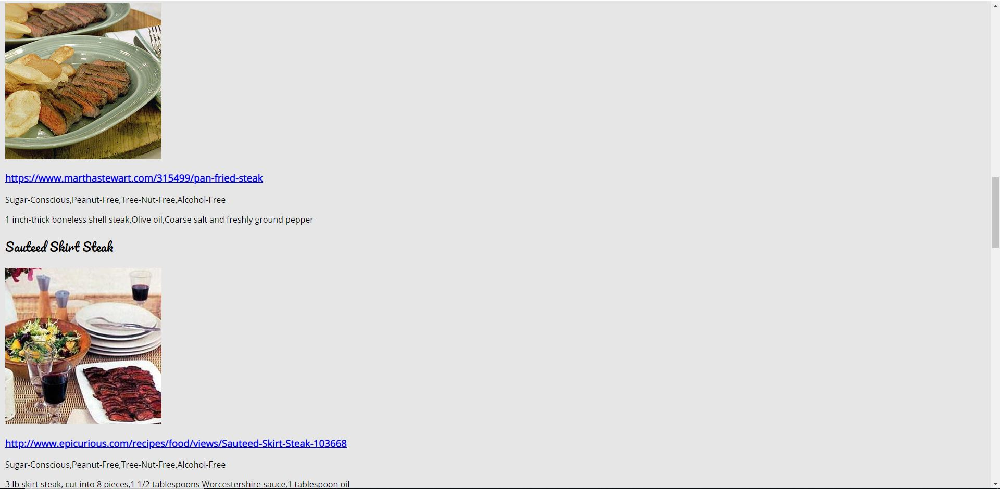

# Whats4Dinner
[Whats4Dinner](https://jtizon.github.io/Whats4Dinner/)

## About
Within the Whats4Dinner app, users are able to search for their dream meal. This dream meal can be searched with 6 specifications, through the actual search input, supplements wanted, diet needed, allergens excluded, calories necessary and other ingredients not wanted. Through the submit button the user will be produced with a maximum of 10 results of recipes that match their search. Users are able to conduct 5 searches within one minute before being timed out.

## Technology Used
* HTML
* CSS
* JavaScript
* jQuery

<select name="diet" id="diet"> 
                    <option value="Select" selected>Select</option>
                    <option value="balanced">Balanced</option>
                    <option value="high-protein">High-protein</option>
                    <option value="low-carb">Low-Carb</option>
                    <option value="low-fat">Low-Fat</option>
            </select>